# 스타벅스 클론코딩

목차

1. 웹 접근성
2. 문제점 및 해결 방안
3. 마크업
4. 프로젝트 진행간 문제점 및 해결방안

## 클론 코딩할때 기존 사이트의 문제점과 해결 방안

기존 스타벅스의 마크업은 암묵적으로 아웃라인을 사용하였다.

```html
<section class="main_prom_bnr">
  <div class="main_prom_bnr_swiper slider">
    <ul class="main_prom_bxslider">
    </ul>
    <div class="main_slider_controller">
      <div class="main_slider_controls"></div>
      <div class="main_slider_pagers"></div>
    </div>
    <p class="main_prevBtn"><a href="javascript:void(0)"><span class="a11y">이전 프로모션</span></a></p>
    <p class="main_nextBtn"><a href="javascript:void(0)"><span class="a11y">다음 프로모션</span></a></p>
  </div>
</section>
```

이는 접근성에서 좋지 않다고 판단을 하여 명시적인 아웃라인을 사용을 해서 아래와 같이 바꾸었다.

```html
<section class="notice">
  <div class="inner">
    <h2 class="notice__heading">공지사항</h2>
    <ul class="notice__list">
      <li><a href="#">더양평 DTR점 주문 시 유의 사항</a></li>
      <li><a href="#">시스템 개선 및 점검 안내</a></li>
      <li><a href="#">홈페이지 이용약관 개정 안내</a></li>
      <li><a href="#">전자영수증 서비스 점검 안내</a></li>
    </ul>
  </div>
</section>
```

이는 별 차이는 안보인다고 보여지지만 접근성 면에서 h2 해딩영역이 보조기기에서 읽어들여서 더 좋은 접근성을 가질수 있다.

그리고 스타벅스에 fix된 광고가 있었다. 그러나 닫기 버튼이 없어서 광고를 제거할 수 없어서 사용자 면에서 불편함을 주어서 버튼을 만들고 없애로 하였지만 아직 자바스크립트가 많이 부족하여 광고 배너는 만들지 않기로 동료와 협의하였다.

## 이미지 해상도 문제

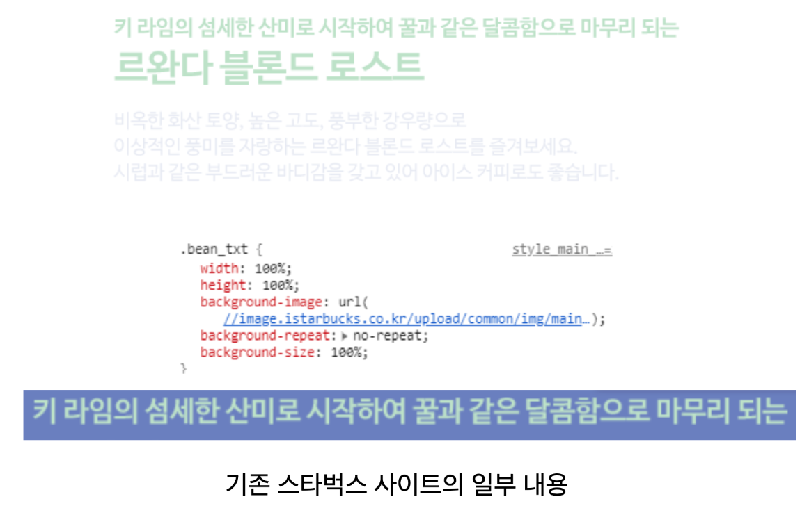

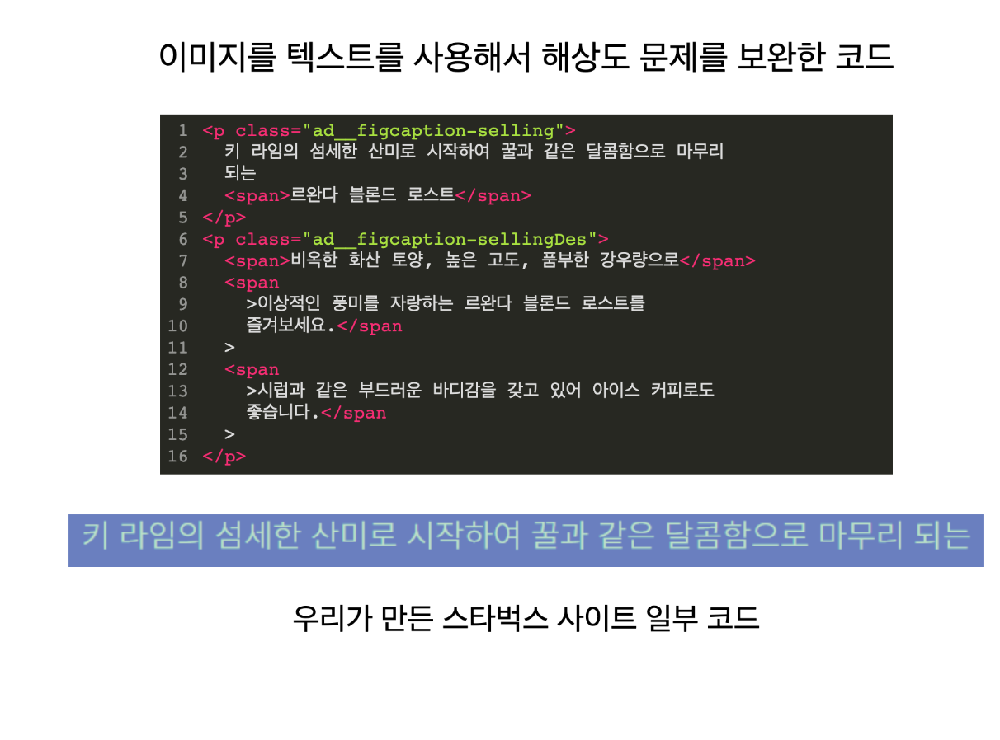

## 웹 접근성 

1. Validator

​      \- HTML

​      \- CSS

2. OpenWax

3. NULI

4. mata tag

5. cross browsing

### Validator

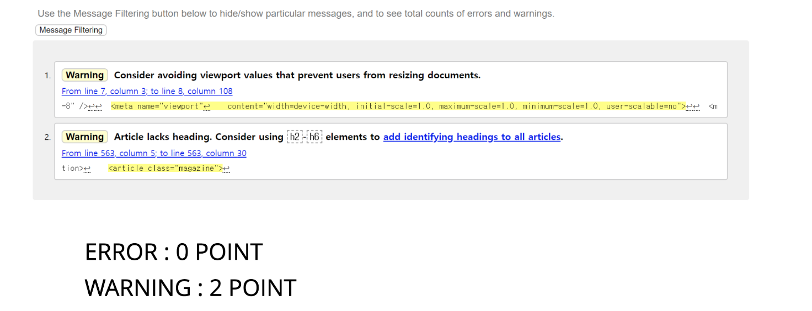

Validator 검사를 통해 많은 오류를 걸러 낼 수 있었다.

### Open Wax

스타벅스 홈페이지 W3C CSS 검사 

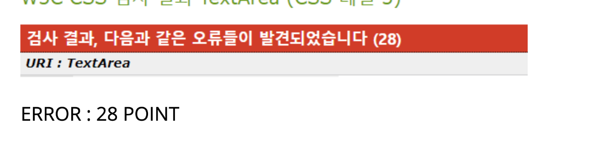

직접 보니 문제점이 많은 스타벅스 웹페이지 었다. 그래서 웹표준을 준수하고 마크업 후 

Open Wax를 검사를 해 보니

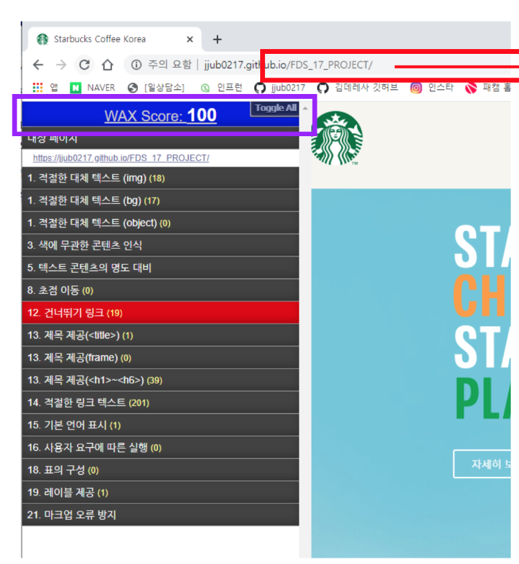

이렇게 100점!

스타벅스 문제점 두번째 적절하지 않은 링크 텍스트

## NULI 웹 접근성 체크리스트

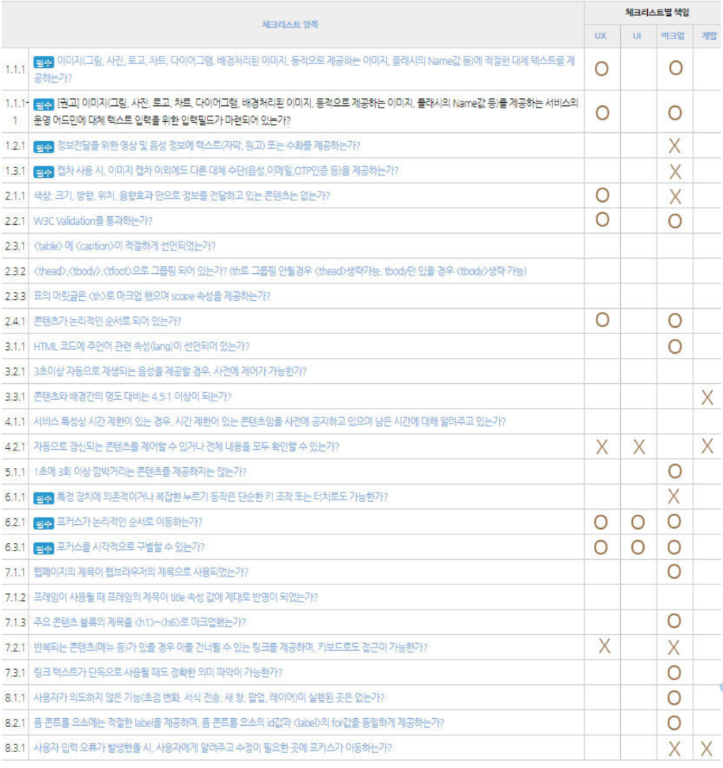

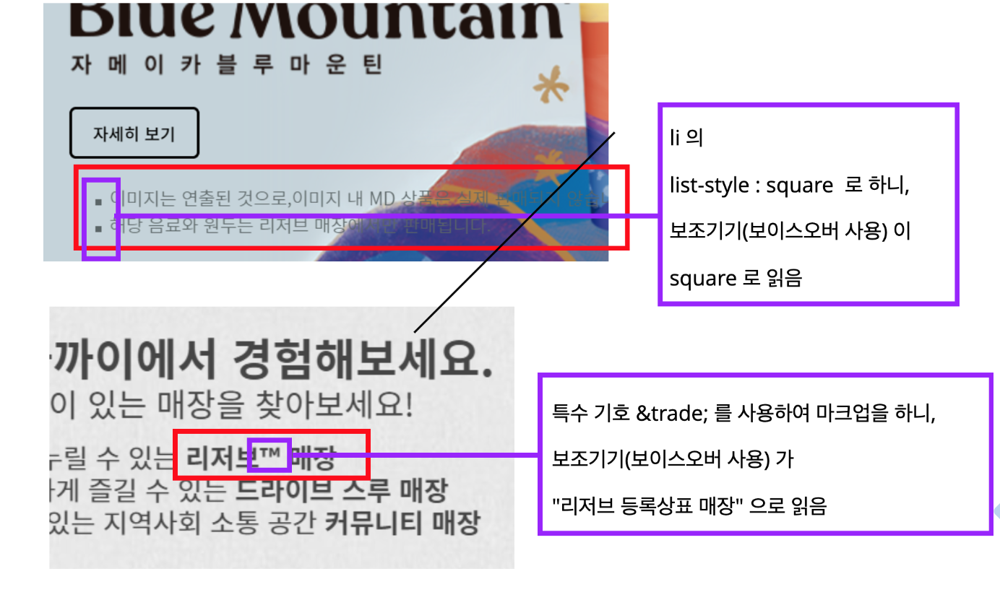

### Meta TEG

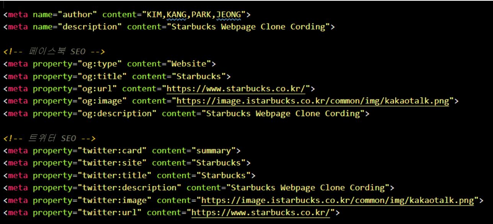

Seo를 신경써서 메타테그 추가


## HTML 마크업

우리팀에서 

### 전체  영역 마크업

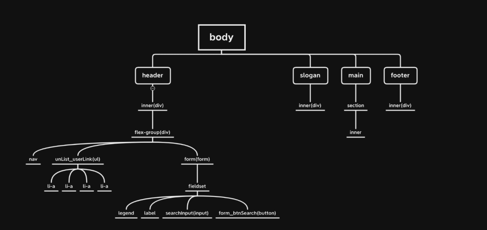


### CSS 초기 과정

1. reset.css
2. 공통(common.css)
3. 자바스크립트 이용 css (isAct.css)
4. style.css

### 공통 CSS (common.css)

1. 기본 글꼴: Noto+Sans 글꼴
2. a11yHidden
3. clearfix
4. inner클래스
5. button 스타일
6. 공통 a 링크 스타일

### Header 구조

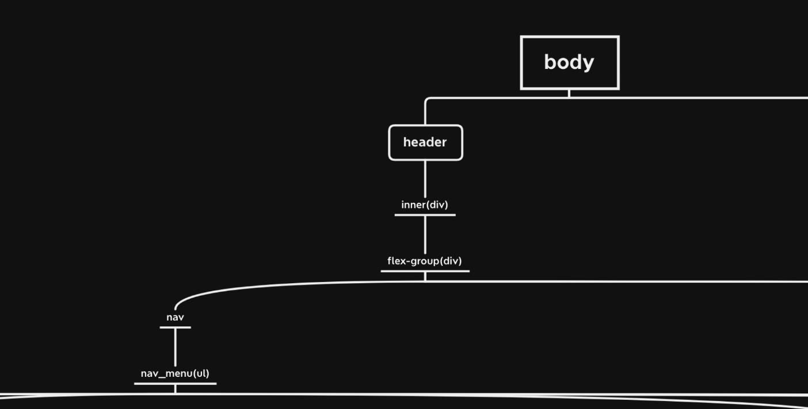

### header - 구조 - Navigation

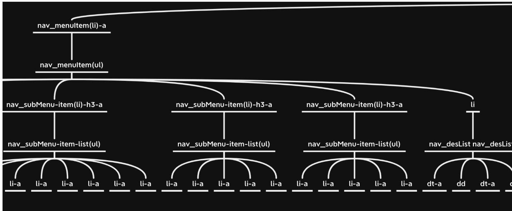

## Slogan 영역

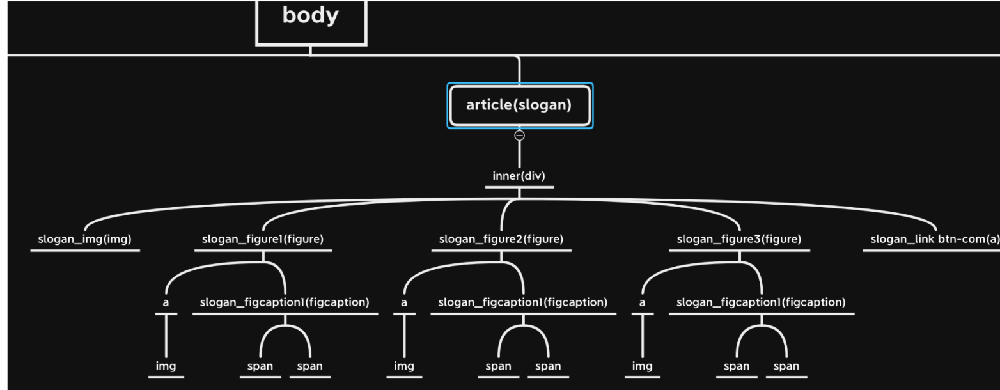


### main 영역 마크업

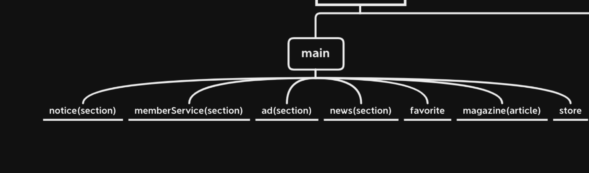


## 프로젝트 진행간 문제점 및 해결방안

1. Search Button 문제

기존 스타벅스 사이트는 Button 클릭 시 Input 창이 열리지만 JavaScript에 대한 지식 부족으로 마우스 오버시 열리고 닫히게만 구현함

2. News 영역 배경 이미지

전체 영역에 배경색과 배경 이미지를 같이 삽입하다 보니 애니메이션 동작 시 배경 이미지만이 아닌 배경색도 같이 애니메이션 되는 문제가 발생

3. h2 문제

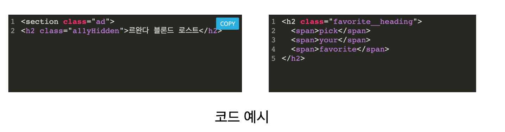

보이스 오버 사용시 위와 같은 h2 요소를 두번 읽게 되는 문제가 발생하였으나 원인을 파악하지 못하여 해결하지 못함


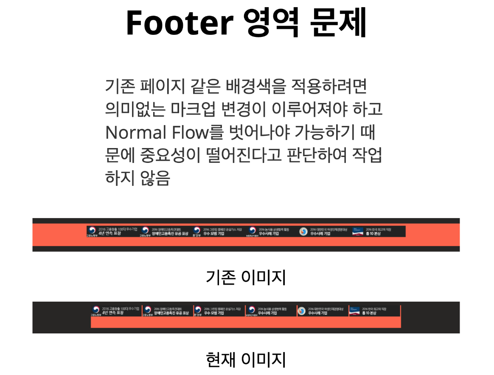


## 끝으로..

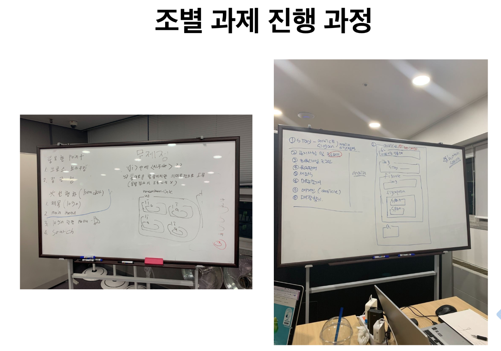


